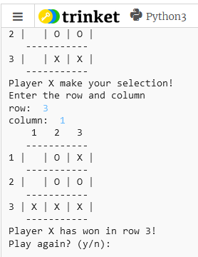

## A fun little terminal implementation of TicTacToe in Python

### Where?
This game is currently being hosted on my website at:
https://brockkeasler.com/tictactoe/

### How to play
1) Find a suitable challenger for a rousing game of TicTacToe
2) Decide who wants to play as 'X' or 'O'
3) Takes turns entering the row and column number of the box each player would like to mark with their 'X' or 'O'
### Win conditions
1) A player wins by getting 3 adjacent marks vertically, horizontally, or diagonally
2) All boxes are filled resulting in a draw (you won because you had fun playing together)
3) One or both of the players gets tired and decides to take a nap (you won because now you're well rested)
